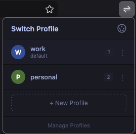
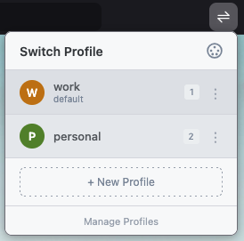

<p align="center">
  
</p>

<h1 align="center">Shiftr</h1>

<p align="center">
  <b>Profile switcher for Firefox</b> — quickly switch, create, rename, and manage your Firefox profiles from a single popup.<br><br>
  <a href="https://addons.mozilla.org/en-GB/firefox/addon/shiftr/">Install from AMO</a>
</p>

Works with the **legacy profile system** (`about:profiles`), **not** the newer `about:profilemanager`.

## Screenshots

<p align="center">
  
  &nbsp;&nbsp;
  
</p>

## Features

- **Switch profiles** — Click a profile to launch it in a new Firefox window
- **Keyboard shortcut** — `Alt+Shift+P` opens the Shiftr popup
- **Quick switch** — Inside the popup, press `1`, `2`, `3`... to jump to a profile by number
- **Create profiles** — Create new profiles directly from the popup without leaving your browser
- **Rename profiles** — Click the three-dot menu on any profile to rename it
- **Set default** — Mark any profile as the default via the context menu
- **Manage profiles** — Quick link to open `about:profiles` for advanced management
- **6 themes** — Cycle through Ayu (Dark, Mirage, Light) and Tokyo Night (Night, Storm, Light) with a single click. Theme choice is persisted across sessions.

## How it works

Firefox extensions can't read the filesystem directly, so Shiftr uses Firefox's **Native Messaging** API. A small Python script (`shiftr_host.py`) reads `profiles.ini`, creates/renames profiles, and launches Firefox with the selected profile via `firefox -P <name> -no-remote`.

## Prerequisites

- **Firefox 109+**
- **Python 3.6+** — Check with `python3 --version`
- **macOS or Linux** (Windows support is partial — the Python host has Windows paths but the install script only supports macOS/Linux)

## Installation

### Step 1: Clone the repository

```bash
git clone <repo-url> shiftr
cd shiftr
```

### Step 2: Install the native messaging host

```bash
./install.sh
```

This does two things:
1. Makes `native-host/shiftr_host.py` executable
2. Writes a manifest file to Firefox's native messaging hosts directory:
   - **macOS:** `~/Library/Application Support/Mozilla/NativeMessagingHosts/`
   - **Linux:** `~/.mozilla/native-messaging-hosts/`

The manifest tells Firefox where to find the Python script and which extension is allowed to use it.

### Step 3: Load the extension in Firefox

Since this is an unsigned extension, load it as a temporary add-on:

1. Open Firefox
2. Go to `about:debugging#/runtime/this-firefox`
3. Click **Load Temporary Add-on...**
4. Navigate to the `extension/` folder and select **`manifest.json`**

The Shiftr icon (swap arrows) will appear in your toolbar.

> **Note:** Temporary add-ons are removed when Firefox restarts. You'll need to reload it each time. See [Permanent Installation](#permanent-installation) below to avoid this.

### Step 4: Verify it works

1. Click the Shiftr icon in the toolbar — you should see your profiles listed
2. Click a profile name to launch Firefox with that profile
3. Try the keyboard shortcut `Alt+Shift+P` to open the popup
4. Click the palette icon in the header to cycle through themes

## Usage

| Action | How |
|---|---|
| Open Shiftr | Click toolbar icon **or** press `Alt+Shift+P` |
| Switch to a profile | Click the profile name in the popup |
| Quick switch by number | Press `1` for first profile, `2` for second, etc. |
| Create a new profile | Click **+ New Profile**, type a name, press Enter or click Create |
| Rename a profile | Click the `⋮` menu on a profile → **Rename** |
| Set default profile | Click the `⋮` menu → **Set as Default** |
| Open about:profiles | Click **Manage Profiles** at the bottom of the popup |
| Change theme | Click the palette icon in the top-right corner of the popup |

The default profile is highlighted and labelled "default" in the popup.

## Themes

Six built-in themes, cycled with the palette button:

| Theme | Style |
|---|---|
| Ayu Dark | Deep dark, warm gold accent |
| Ayu Mirage | Blue-grey dark, bright gold accent |
| Ayu Light | Clean white, orange accent |
| Tokyo Night | Indigo dark, blue accent |
| Tokyo Storm | Lighter indigo, blue accent |
| Tokyo Night Light | Cool grey light, deep blue accent |

Your theme choice is saved and persists across popup opens and browser restarts.

## Building

To build a distributable `.zip`:

```bash
cd extension
npx web-ext build
```

The output will be at `extension/web-ext-artifacts/shiftr-1.0.0.zip`.

To lint the extension for AMO compliance:

```bash
cd extension
npx web-ext lint
```

## Permanent Installation

Temporary add-ons are fine for testing but get removed on restart. To install permanently:

### Option A: Use web-ext for development

```bash
cd extension
npx web-ext run
```

This launches Firefox with the extension auto-loaded and auto-reloaded on file changes.

### Option B: Sign and distribute

Sign via Mozilla's Add-on Developer Hub:

```bash
cd extension
npx web-ext sign --api-key=YOUR_KEY --api-secret=YOUR_SECRET
```

Or submit to [addons.mozilla.org](https://addons.mozilla.org) for public distribution.

> **Note:** Even with a signed extension, you still need to run `./install.sh` on each machine to register the native messaging host.

## Customising the keyboard shortcut

If `Alt+Shift+P` conflicts with another extension or tool, you can change it in Firefox:

1. Go to `about:addons`
2. Click the gear icon (top right) and select **Manage Extension Shortcuts**
3. Find **Shiftr** and set your preferred shortcut

## Troubleshooting

### "Cannot connect to native host" error

- Make sure you ran `./install.sh` first
- Verify the manifest exists:
  - macOS: `cat ~/Library/Application\ Support/Mozilla/NativeMessagingHosts/shiftr_host.json`
  - Linux: `cat ~/.mozilla/native-messaging-hosts/shiftr_host.json`
- Check that the `"path"` in the manifest points to the correct absolute path of `shiftr_host.py`
- Ensure Python 3 is available: `python3 --version`

### No profiles listed

- Shiftr reads from `profiles.ini`, which is managed by `about:profiles` (the legacy system)
- If you created profiles using the newer `about:profilemanager`, they won't appear here
- Verify your legacy profiles exist: open `about:profiles` in Firefox
- Check that `profiles.ini` is readable:
  - macOS: `cat ~/Library/Application\ Support/Firefox/profiles.ini`
  - Linux: `cat ~/.mozilla/firefox/profiles.ini`

### Profile launches but opens a new window in the same profile

- This can happen if Firefox is already running that profile. The `-no-remote` flag should handle this, but if it doesn't, close the target profile's window first.

### Create profile fails or times out

- Firefox must be findable at the expected path:
  - macOS: `/Applications/Firefox.app`
  - Linux: `firefox` on PATH
- Profile names may only contain letters, numbers, spaces, hyphens, underscores, and dots

## about:profiles vs about:profilemanager

Firefox has two profile systems:

- **`about:profiles`** (legacy) — Profiles stored in `profiles.ini`. This is what Shiftr reads and manages. Profiles created here are independent Firefox instances with separate bookmarks, history, extensions, etc.
- **`about:profilemanager`** (new) — A newer profile system introduced in recent Firefox versions with a different UI and storage mechanism. Shiftr does **not** support these profiles.

If you're unsure which system you use, open `about:profiles` in Firefox. If you see your profiles listed there, Shiftr will work for you.

## Project structure

```
shiftr/
├── extension/
│   ├── manifest.json          # Extension manifest (permissions, shortcut, metadata)
│   ├── background.js          # Listens for keyboard shortcut, opens popup
│   ├── popup/
│   │   ├── popup.html         # Popup UI shell
│   │   ├── popup.css          # 6 theme definitions + base styles using CSS variables
│   │   └── popup.js           # Profile listing, switching, creation, renaming, theming
│   └── icons/
│       ├── icon-48.svg        # Toolbar icon (white swap arrows, transparent bg)
│       ├── icon-96.svg        # High-DPI toolbar icon
│       ├── icon-ext-48.svg    # Extensions page icon (dark bg)
│       └── icon-ext-96.svg    # High-DPI extensions page icon
├── native-host/
│   ├── shiftr_host.py         # Native messaging host (reads/writes profiles.ini)
│   └── shiftr_host.json       # Manifest template (install.sh generates the real one)
├── install.sh                 # Registers native messaging host with Firefox
├── LICENSE                    # MIT License
└── README.md
```

## License

[MIT](LICENSE)
